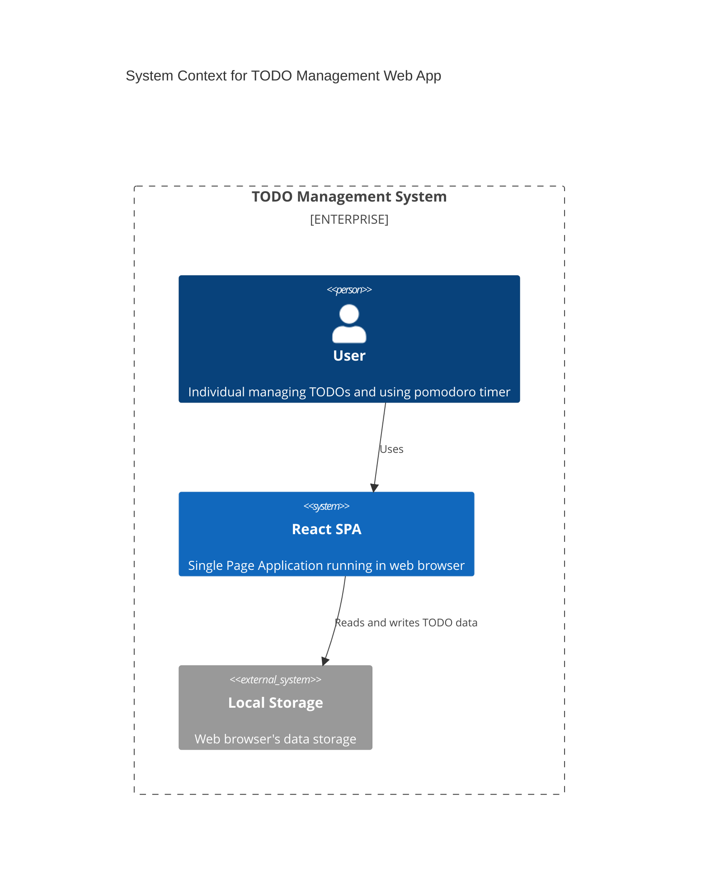
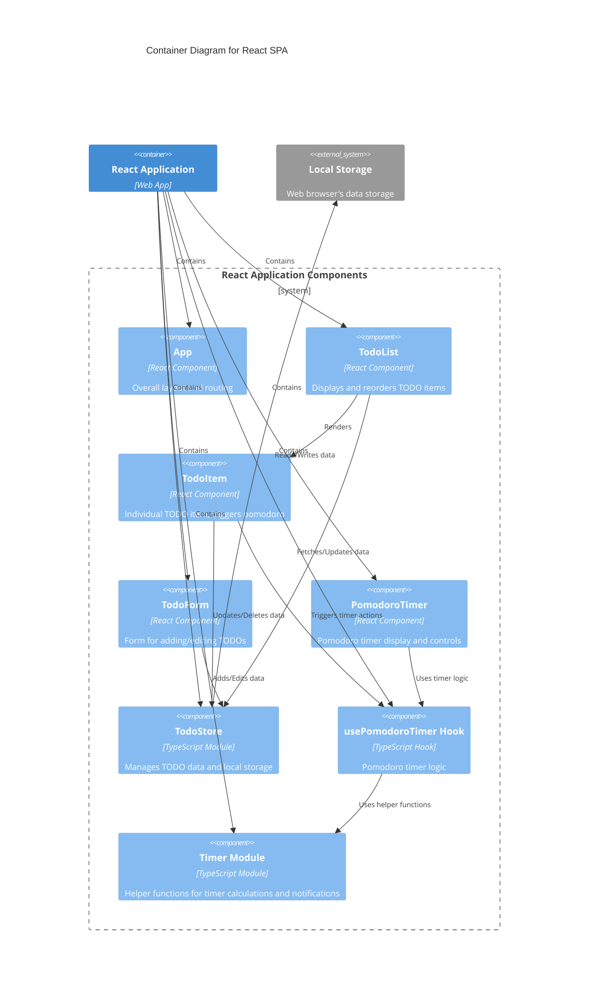

# アーキテクチャ図

## 1. システムアーキテクチャ

## 2. コンポーネント構成

## 3. 依存関係

- **Frontend Framework**: React
- **Build Tool**: Vite
- **Styling**: Tailwind CSS
- **State Management**: React Context API / useState
- **Data Persistence**: Local Storage (browser feature)
- **Custom Hooks**: usePomodoroTimer (reusable timer logic)
- **Utility Functions**: Helper functions for timer calculations and notifications (src/utils/timer.ts)