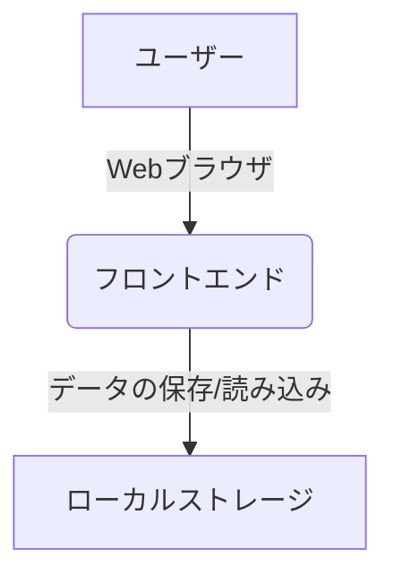
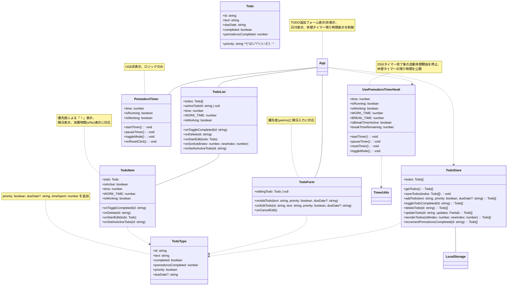

# 設計書

## 1. システム構成図

### 説明
本アプリケーションはクライアントサイドのみで動作し、ユーザーインターフェースはReactとTypeScriptで構築されます。データの永続化にはブラウザのLocalStorageを使用します。

## 2. クラス図 (主要コンポーネント)

### 説明
- `TodoApp`: アプリケーションのメインコンポーネント。日付表示、TODOフォームの表示/非表示、タイマー残り時間の表示を管理します。
- `TodoForm`: TODOの追加を担当します。優先度と期日も入力できるように変更されます。
- `TodoList`: TODOアイテムのリストを表示します。
- `TodoItem`: 個々のTODOアイテムを表示します。優先度、期日、消費時間の表示ロジックが追加されます。
- `PomodoroTimer`: ポモドーロタイマーのロジックを含みますが、UIは表示されません。バックグラウンドで動作し、完了イベントを`TodoApp`に通知します。

### 3.1 TODO追加シーケンス
1. ユーザーがTODOリストの空きスペースをクリックし、TODO入力フィールドを表示後、テキストを入力し、「追加」ボタンをクリックする。
2. `TodoForm` コンポーネントが入力値を取得し、`App.tsx`の`handleAddTodo`を呼び出す。
3. `App.tsx`が`todoStore.addTodo`を呼び出し、新しいTODOアイテムを**TODOリストの先頭に**追加し、Local Storageに保存する。
4. `App.tsx`の状態更新により、`TodoList` コンポーネントに新しいTODOアイテムがプロップスとして渡され、リストに表示される。**また、TODO追加フォームは非表示になる。**

### 6.2 ポモドーロ開始・終了・モード切り替えシーケンス
1. ユーザーが未完了のTODOアイテムをクリックする。
2. `TodoItem` コンポーネントがクリックイベントを検知し、`App.tsx`の`handleSetAsActiveTodo`を呼び出す。
3. `App.tsx`の`handleSetAsActiveTodo`は、現在アクティブなTODOを管理し、`usePomodoroTimer`フックのタイマー操作（`startTimer`）を制御する。
    - **タイマーが停止中の場合（初回）**: `startTimer()`で作業タイマーを開始する。TODOの横にタイマーの進捗を示すUIが表示される。
    - **作業時間が終了した場合（`time === 0` かつ `isWorking` が `true`）**: `todoStore.incrementPomodorosCompleted(id)`を呼び出し、該当TODOのポモドーロ完了回数を増やす。その後、**作業タイマーの進捗円がクリックされた場合に**、休憩モードに切り替え、`startTimer()`で休憩タイマー（5分）を開始する。
    - **休憩時間が終了した場合（`time === 0` かつ `isWorking` が `false`）**: `toggleMode()`で作業モードに切り替える。タイマーは自動で再開せず、ユーザーのクリックを待つ。
4. `usePomodoroTimer`フックがタイマーのカウントダウンを行い、残り時間（`time`）、実行状態（`isRunning`）、モード（`isWorking`）を管理する。
5. `App.tsx`は`usePomodoroTimer`フックからこれらの状態を受け取り、`PomodoroTimer`コンポーネントと`TodoList`/`TodoItem`コンポーネントにプロップスとして渡す。
6. `PomodoroTimer`コンポーネントは現在のタイマー状態を表示し、`TodoList`/`TodoItem`コンポーネントはTODOアイテムごとにタイマーの進捗UI（円やポモドーロ完了回数）を更新して表示する。
    - **通知について**: タイマー終了時に音とポップアップ通知がトリガーされる。

## 7. データフロー図

### 4.1 データ保存・更新フロー
- **ユーザー入力**: ユーザーがUIを操作し、TODOの追加・編集・削除、**ポモドーロの開始・休憩**を行う。
- **Reactコンポーネント**: `TodoForm` や `TodoItem` などのコンポーネントがユーザー入力を受け付け、必要なデータを整形する。
- **`TodoStore`**: 整形されたデータは `TodoStore` に渡され、内部のTODOリストが更新される。**特にTODOごとのポモドーロ完了回数（`pomodorosCompleted`）が更新される。** また、Local Storageへの永続化処理も `TodoStore` が担当する。
- **Local Storage**: `TodoStore` によってデータが読み書きされ、ブラウザのローカルストレージに保存される。

### 4.2 タイマー・UI更新フロー
- **ユーザー操作**: **TODOアイテムのクリック**により、**タイマーの開始がトリガーされる。また、TODOリストの空きスペースをクリックすることでTODO追加フォームの表示・非表示が切り替わり、TODOアイテムにホバーすることでEdit/Deleteボタンが表示される。**
- **タイマーロジック**: `usePomodoroTimer` hook がタイマーのカウントダウン、作業/休憩時間の管理、通知トリガーを制御する。
- **Reactコンポーネント**: `PomodoroTimer` や `TodoItem` などのコンポーネントが `usePomodoroTimer` hook からタイマーの状態（残り時間、アクティブ状態、作業/休憩状態）を受け取り、UIを更新する。
- **UI表示**: 更新されたタイマーの残り時間（**休憩タイマーが動作している場合のみ画面上部に表示**）、TODOの進捗円、ポモドーロ完了回数（**「x」または「Nx」形式**）などがユーザーインターフェースに反映される。**アプリケーションヘッダーには現在の日付と曜日が表示される。ポモドーロタイマーUIは表示されない。優先度が「はい」のTODOタイトル前には「！」が表示され、期日はTODOタイトルの次の行に小さめのフォントで表示される。TODO画面は常にデバイスの画面全体を占め、「Edit」ボタンクリック時にTODOフォームをTODOアイテム直下に表示する。**